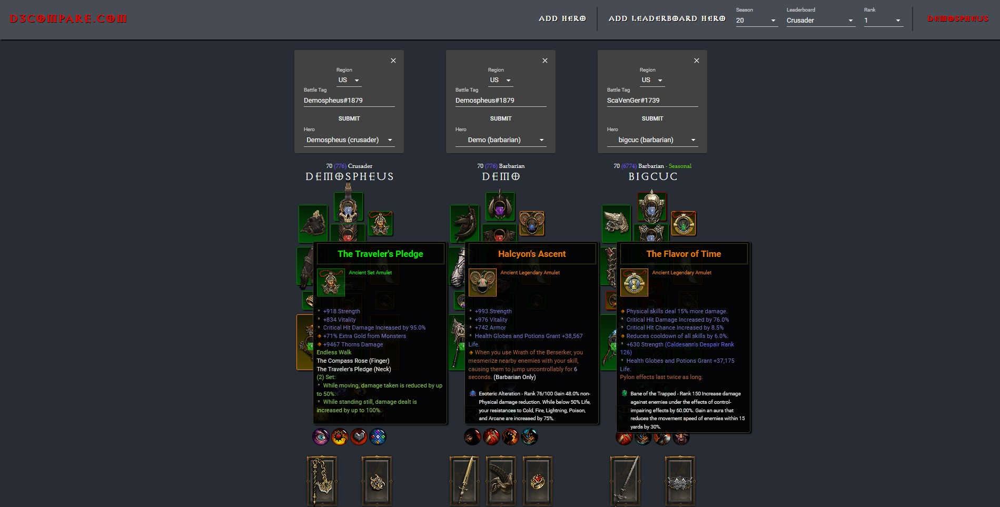

# D3Compare

D3Compare is an application for comparing Diablo 3 characters.  

## GETTING STARTED

D3Compare acts as a proxy for the Blizzard Diablo 3 API.  To run D3Compare, you will need to configure a [Blizzard API OAuth Client](https://develop.battle.net/access/clients).  D3Compare uses two OAuth2 flows:

|Flow|Description|
|----|-------|
|authorization_code|Used for users logging in to D3Compare with a Blizzard account.  Of note, your Blizzard API Client will need to be configured to support a valid redirect URI. If running locally, this should be http://localhost:8080|
|client_credentials|Used for D3Compare itself to authenticate to Blizzard's APIs.|

After configuring the API Client, you will need to configure the following environment variables for D3Compare:

|Environment Variable|Description|
|--------------------|-----------|
|D3_CLIENT_ID|Your Blizzard API Client ID|
|D3_CLIENT_SECRET|Your Blizzard API Client Secret|

D3Compare runs on a React front-end and Spring Boot back-end.  To run the application, ensure java 8 and [yarn](https://classic.yarnpkg.com/en/docs/install/) are installed, and run `./d3compare_start.sh`.